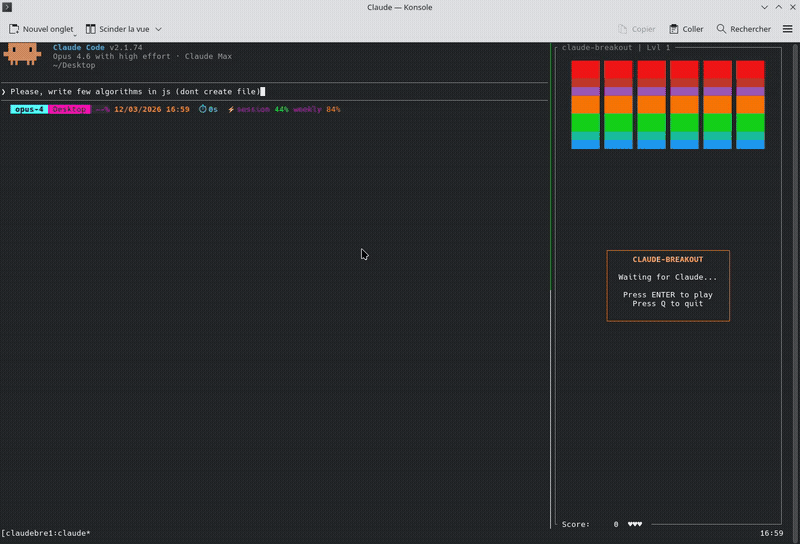

# claude-breakout 🧱

A terminal Breakout game that you play **while waiting for Claude Code** to finish processing.

The game auto-pauses when Claude responds and auto-resumes when you submit a new prompt. No more staring at a spinner.



## How it works

```
┌─────────────────────────────────┬──────────────────┐
│                                 │   ██████ ██████  │
│     Claude Code                 │   ██████ ██████  │
│                                 │   ██████ ██████  │
│  ⏳ Thinking...                 │       ●      x3  │
│                                 │     ━━━━━━━      │
│                                 │  Score: 420  ♥♥♥ │
└─────────────────────────────────┴──────────────────┘
```

Uses Claude Code's [hook system](https://docs.anthropic.com/en/docs/claude-code/hooks) to detect when Claude starts/stops processing:

- **`UserPromptSubmit`** hook → sends `SIGUSR1` → game **unpauses**
- **`Stop`** hook → sends `SIGUSR2` → game **pauses**

Zero interference with your workflow.

## Install

One command. Installs everything (Rust, tmux, binary, hooks):

```bash
curl -fsSL https://raw.githubusercontent.com/monkeycs60/claude-breakout/master/install-remote.sh | bash
```

That's it. The script handles:
1. Installing Rust if missing (via [rustup](https://rustup.rs))
2. Installing tmux if missing (via your package manager)
3. Building the game binary
4. Configuring Claude Code hooks
5. Creating the `claudebreak` launcher
6. Adding `~/.local/bin` to your PATH

## Update

If you built from source and want the latest version:

```bash
cd claude-breakout
git pull
cargo build --release
cp target/release/claude-breakout ~/.local/bin/claude-breakout
```

> **Note:** quit the game first (`Q`) — you can't overwrite a running binary.

Or just re-run the one-liner install, it will rebuild from the latest master.

## Usage

### With tmux (recommended)

```bash
claudebreak                      # Side by side: Claude Code + Breakout

# Layout options
claudebreak --no-autofocus       # Don't auto-switch focus between panes
claudebreak --bottom             # Game pane on the bottom
claudebreak --left               # Game pane on the left
claudebreak --size 40            # Game pane takes 40% of terminal

# Pass flags to Claude Code (everything after --)
claudebreak -- --dangerously-skip-permissions
claudebreak -- -p "fix the tests"
claudebreak --left -- --model sonnet
```

Focus auto-switches to the game when you submit a prompt, and back to Claude Code when it finishes.

### Without tmux

Just open two terminals:
1. Run `claude` (Claude Code) in one
2. Run `claude-breakout` in the other

The hooks still work — the game will auto-pause/resume via Unix signals regardless of your terminal setup. You just won't get auto-focus switching.

### Standalone (no Claude Code)

```bash
claude-breakout                   # Just play the game!
```

Press `Enter` to start, `Space` to pause. Works without any hooks.

## Controls

| Key | Action |
|-----|--------|
| `← →` | Move paddle |
| `Space` | Pause / Resume |
| `Enter` | Start / Restart |
| `S` | Share score (at Game Over) |
| `Q` | Quit |

## Game Modes

### Free Play (default)

Classic breakout with random powerup drops. Play as many levels as you can.

```bash
claude-breakout
```

### Daily Challenge

Everyone gets the **same game** each day — same brick patterns, same powerup drops, same seed. Compete on the daily leaderboard. Like Wordle, but with bricks.

```bash
claude-breakout --daily
```

## Features

- **Auto pause/resume** via Claude Code hooks
- **Auto-focus** — tmux switches between game and Claude panes automatically
- **Progressive difficulty** — ball starts slow, accelerates as you destroy bricks
- **6 level patterns** — full grid, pyramid, checkerboard, diamond, stripes, inverted pyramid (cycling)
- **Multi-hit bricks** — from level 4+, top rows require 2-3 hits (▒ = 2 hits, ▓ = 3 hits)
- **Combo system** — consecutive brick hits without touching the paddle build a multiplier (x2 at 5 hits, x3 at 10, up to x5)
- **Daily challenge** — seeded RNG, same game for everyone, daily leaderboard
- **Global leaderboard** — scores auto-submitted to Cloudflare Workers backend
- **Share score** — press `S` at Game Over to copy a shareable snippet to clipboard
- **Powerups** (rare ~5% drop rate):
  - `◆W` Wide paddle (10s) — paddle grows 1.5x
  - `◆M` Multi-ball — spawns 2 extra balls (max 12)
  - `◆S` Slow-mo (8s) — ball speed halved
- **Grace period** — ball slows down for 1s after resuming so you don't get blindsided
- **Responsive** — adapts to terminal/pane size, auto-rescales on resize
- **Lightweight** — single ~2.7MB binary, ~30 FPS, minimal CPU

## CLI Options

```
Usage: claude-breakout [OPTIONS]

Options:
  -d, --daily       Daily challenge (same seed for everyone today)
  -s, --scores      Show leaderboard and exit
  -n, --name NAME   Set player name
  -V, --version     Show version
  -h, --help        Show this help
```

## Leaderboard

Scores are automatically submitted at Game Over to a global leaderboard. View it from the terminal:

```bash
claude-breakout --scores
```

Set your player name:

```bash
claude-breakout --name your_name
```

## Requirements

- [Rust](https://rustup.rs) (to build)
- [tmux](https://github.com/tmux/tmux) (optional — for side-by-side mode + auto-focus)
- [Claude Code](https://docs.anthropic.com/en/docs/claude-code) (optional — for auto pause/resume)

## Uninstall

```bash
rm ~/.local/bin/claude-breakout ~/.local/bin/claudebreak
rm -rf ~/.claude-breakout
# Remove hooks from ~/.claude/settings.json
# (delete the "UserPromptSubmit", "Stop", "PermissionRequest" and "Notification" entries containing "claude-breakout")
```

## License

MIT
